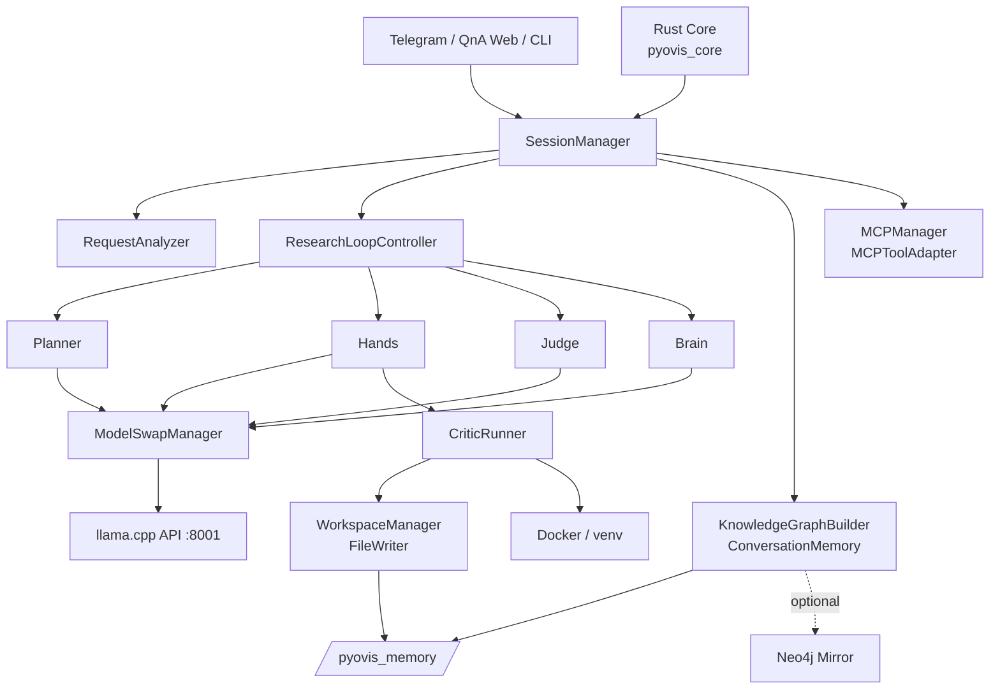

# Pyovis

[](https://www.python.org/)
[](https://www.rust-lang.org/)
[](https://developer.nvidia.com/cuda-toolkit)
[](https://github.com/ggml-org/llama.cpp)

Pyovis is a local multi-role AI agent focused on iterative coding, critique, tool use, and memory.

The repository combines a Python orchestration layer, a Rust extension module, a single llama.cpp inference server with model hot-swap, Docker-based execution, graph memory, MCP integration, and multiple interfaces including Telegram, a graph viewer, and a QnA web app.

## Current Repository State

This codebase contains a mix of runtime naming from the v4 line and design artifacts labeled v5.x. The documents in this repository now describe the implemented code that is currently checked in rather than the older planning snapshots.

## Highlights

- Multi-role LLM workflow with Planner, Brain, Hands, and Judge roles.
- Single local inference endpoint with model swap instead of permanently loaded parallel models.
- Critique loop that executes generated code, classifies failures, and requests revisions.
- Persistent knowledge graph memory with optional Neo4j mirroring.
- MCP tool discovery and tool-calling adapter layer.
- Telegram bot interface, knowledge graph web viewer, and standalone QnA web app.
- Rust core module for queueing, model-swap support, and worker primitives.

## Runtime Overview



```text
Telegram / QnA Web / CLI
     |
     v
   SessionManager
      |- RequestAnalyzer
      |- Planner / Brain / Hands / Judge
      |- ResearchLoopController
      |- MCPManager + MCPToolAdapter
      |- KnowledgeGraphBuilder
      |- ConversationMemory
     |
     v
     CriticRunner
     |
     v
  WorkspaceManager + FileWriter
     |
     v
      /pyovis_memory

Model inference is served by llama.cpp on port 8001.
```

## System Architecture

```text
+-------------------------------------------------------------------+
| Interface Layer                                                   |
| Telegram Bot | QnA Web App | KG Web Viewer | CLI / Legacy Launchers|
+-------------------------------+-----------------------------------+
                                |
                                v
+-------------------------------------------------------------------+
| Orchestration Layer                                               |
| SessionManager | RequestAnalyzer | ResearchLoopController         |
+-------------------------------+-----------------------------------+
                                |
                                v
+-------------------------------------------------------------------+
| AI Role Layer                                                     |
| Planner | Brain | Hands | Judge | ModelSwapManager               |
+-------------------------------+-----------------------------------+
                                |
                                v
+-------------------------------------------------------------------+
| Tool / Execution Layer                                            |
| MCPManager | MCPToolAdapter | CriticRunner | WorkspaceManager     |
+-------------------------------+-----------------------------------+
                                |
                                v
+-------------------------------------------------------------------+
| Memory Layer                                                      |
| KnowledgeGraphBuilder | ExperienceDB | ConversationMemory         |
| Optional Neo4jGraphMirror                                         |
+-------------------------------+-----------------------------------+
                                |
                                v
+-------------------------------------------------------------------+
| Infrastructure Layer                                              |
| llama.cpp | Docker | virtualenv | /pyovis_memory | Rust core      |
+-------------------------------------------------------------------+
```

아키텍처 관점에서 보면 Pyovis는 단순 챗봇이 아니라, 인터페이스 계층 위에 오케스트레이션과 역할 분리된 LLM 계층이 있고, 그 아래에 실행 계층과 메모리 계층이 붙는 구조입니다. 실제 추론은 llama.cpp 단일 엔드포인트를 공유하고, 역할 전환은 `ModelSwapManager`가 담당합니다.

## Roles And Responsibilities

| Role | Default model | Responsibility |
|------|---------------|----------------|
| Planner | GLM-4.7-Flash 30B | Decompose tasks, define todo lists, pass criteria, and file structure |
| Brain | Qwen3-14B | Review, synthesis, escalation, direct-answer behavior |
| Hands | Devstral-Small-2-24B | Build and revise code, generate execution steps |
| Judge | DeepSeek-R1-Distill-Qwen-14B | Score outcomes and return PASS, REVISE, ENRICH, or ESCALATE |

## Technology Stack

| Area | Technology | Purpose |
|------|------------|---------|
| Core runtime | Python | Orchestration, interfaces, execution, memory, tools |
| Native module | Rust + PyO3 + maturin | Queue, swap-related primitives, thread-pool support |
| Inference | llama.cpp | Local OpenAI-compatible chat endpoint on port 8001 |
| Web APIs | FastAPI, Starlette, Uvicorn | QnA app, KG viewer, memory service |
| HTTP | httpx | LLM requests, tool fetching, streaming client calls |
| Memory | JSON graph, NetworkX, optional Neo4j mirror | Graph persistence, community detection, graph queries |
| Retrieval | FAISS, sentence-transformers | Vector search support in memory services |
| Execution | Docker, virtualenv | Sandboxed code execution and dependency setup |
| Config | PyYAML, dotenv | Runtime configuration and environment loading |
| Interface | python-telegram-bot | Telegram bot runtime |
| Data utilities | numpy, pandas | Analysis and data handling helpers |
| Testing | pytest, pytest-asyncio | Unit and integration test suites |

## Main Components

| Package | Purpose |
|---------|---------|
| `pyovis/orchestration` | Session routing, loop control, request analysis, limits, symbol extraction |
| `pyovis/ai` | Role-specific LLM wrappers, prompts, and model swap manager |
| `pyovis/execution` | Critic runner, execution plans, workspace snapshots, file persistence |
| `pyovis/memory` | Knowledge graph builder, experience DB, conversation memory, Neo4j mirror |
| `pyovis/mcp` | MCP client, registry explorer, tool adapter, tool registry |
| `pyovis/interface` | Telegram bot and knowledge graph web viewer |
| `pyovis/monitoring` | Health, log, and watchdog helpers |
| `pyovis_core` | Rust extension module exposed to Python |
| `qna_bot` | Standalone project QnA web application |

## Repository Structure

```text
pyovis/
  ai/             LLM role wrappers and prompts
  execution/      sandbox execution, file writes, snapshots, static analysis
  interface/      Telegram bot and knowledge graph viewer
  mcp/            MCP connection and tool adapter layer
  memory/         graph memory, experience DB, conversation memory, Neo4j mirror
  monitoring/     runtime monitoring utilities
  orchestration/  SessionManager, loop controller, request analyzer
  skill/          skill loading and validation
  tracking/       loop tracking
pyovis_core/      Rust workspace member with PyO3 bindings
qna_bot/          FastAPI-based project QnA application
config/           unified runtime configuration
docker/           sandbox image assets
scripts/          model startup, validation, stress and e2e helpers
tests/            pytest suites for AI, orchestration, execution, memory, integration
```

## Interfaces And Entry Points

| Entry point | What it starts |
|-------------|----------------|
| `pyovis` | Unified launcher: Telegram bot, KG web viewer, SessionManager, llama.cpp model launcher |
| `python run_unified.py` | Legacy unified launcher |
| `python run_qna.py` | Standalone QnA web app on port 8080 |
| `python -m pyovis.main` | Core session loop plus KG server startup |
| `./scripts/start_model.sh <role>` | Direct llama.cpp role startup and swapping |

## Ports And Runtime Services

| Service | Default port | Notes |
|---------|--------------|-------|
| llama.cpp server | 8001 | OpenAI-compatible local inference endpoint |
| KG web viewer | 8502 | Starlette viewer for the persisted graph |
| QnA web app | 8080 | FastAPI app for project-aware QnA |
| Neo4j browser | 7474 | Optional, when Neo4j mirror is enabled |
| Neo4j bolt | 7687 | Optional, when Neo4j mirror is enabled |

## Quick Start

### 1. Clone the repository

```bash
git clone https://github.com/organic4597/Pyovis.git
cd Pyovis
```

### 2. Install Python and Rust dependencies

```bash
pip install -e .
pip install python-telegram-bot python-dotenv
```

For development:

```bash
pip install -e .[dev]
```

### 3. Prepare external runtime dependencies

The repository intentionally excludes llama.cpp and local model files.

```bash
git clone https://github.com/ggml-org/llama.cpp /Pyvis/llama.cpp
```

You also need GGUF model files under `/pyovis_memory/models` that match the paths in `config/unified_node.yaml` and `scripts/start_model.sh`.

### 4. Set environment variables

Minimum runtime setup:

```bash
export TELEGRAM_BOT_TOKEN=your_token_here
```

Optional Neo4j mirror:

```bash
export PYOVIS_NEO4J_URI=bolt://localhost:7687
export PYOVIS_NEO4J_USERNAME=neo4j
export PYOVIS_NEO4J_PASSWORD=your_password
```

### 5. Start the system

Unified launcher:

```bash
pyovis
```

Standalone QnA app:

```bash
./scripts/start_model.sh brain
python run_qna.py --port 8080
```

Direct model control:

```bash
./scripts/start_model.sh brain
./scripts/start_model.sh hands
./scripts/start_model.sh judge
./scripts/start_model.sh status
./scripts/start_model.sh stop
```

## Persistence Layout

Pyovis uses `/pyovis_memory` as its runtime storage root.

| Path | Purpose |
|------|---------|
| `/pyovis_memory/models` | GGUF model files |
| `/pyovis_memory/workspace` | Generated and executed workspaces |
| `/pyovis_memory/kg` | Knowledge graph persistence and visualization output |
| `/pyovis_memory/logs` | Model server and swap logs |
| `/pyovis_memory/loop_records` | Loop tracking output |

## Testing

The repository includes pytest suites for:

- AI modules
- orchestration and task classification
- file writing and search/replace
- graph builder and Neo4j integration
- end-to-end loop behavior
- phase integration pipelines

Run tests with:

```bash
pytest tests -v
cargo test --workspace
```

## Recommended Documentation

- `ARCHITECTURE.md` for the current implemented architecture
- `config/unified_node.yaml` for runtime model and hardware settings
- `pyovis_v5_3.md` and `pyovis_v5_3_ko.md` for higher-level spec snapshots

## Notes For GitHub Distribution

The public repository intentionally excludes large local binaries, secrets, archived planning artifacts, and vendor snapshots. That keeps the repository focused on the code, configuration, and reproducible runtime layout.
